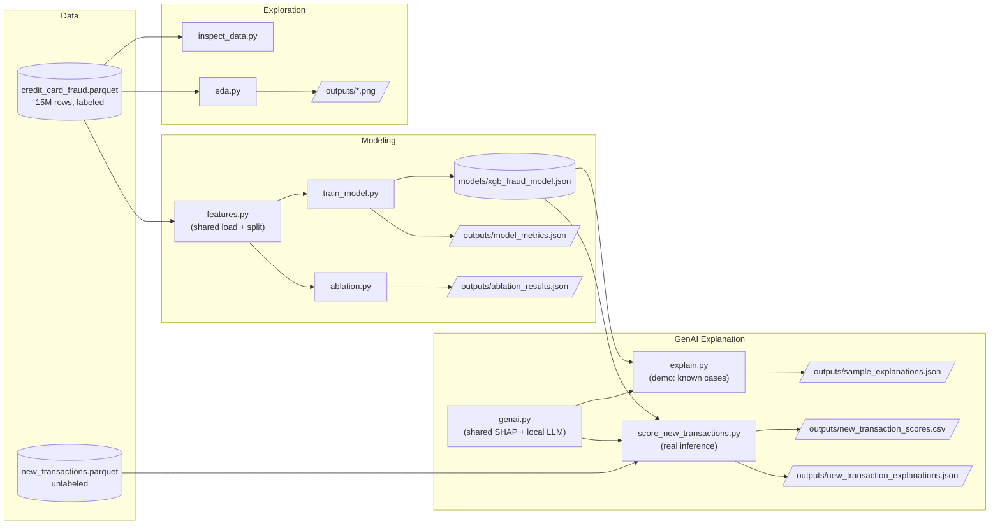

# Card Fraud Detection & Analysis

## Overview

Fraud teams at banks are flooded with flagged transactions every day. A machine learning model can score a transaction as suspicious, but a raw probability score or a binary flag doesn't tell an analyst *why* a transaction looks wrong, or what kind of fraud pattern it resembles. That gap slows down investigation and makes it harder to trust and act on model output quickly.

I wanted to build something that closes that gap: a fraud detection model paired with a generative AI layer that turns a flagged transaction and its model output into a short, plain-English explanation an analyst can act on immediately.

## What It Does

1. **Detects fraud** using a machine learning model (XGBoost) trained on a large synthetic transaction dataset with realistic behavioral features — transaction amount deviation, geo-velocity, device and network signals, authentication results, and account history.
2. **Explains the flag** using an LLM that takes a flagged transaction's SHAP-attributed model signals and produces a short, human-readable explanation of why it was flagged, referencing the specific signals involved (for example, an unusual geo-velocity pattern combined with a CVV mismatch). I run this with a small open-weight instruction-tuned model (`Qwen2.5-1.5B-Instruct`) locally via Hugging Face `transformers` — no API key, no external calls.

## Project Structure

```
card-fraud-detection-analysis/
├── data/              # Parquet dataset (gitignored)
├── src/
│   ├── inspect_data.py
│   ├── eda.py
│   ├── features.py               # shared feature loading, reused by train_model.py and score_new_transactions.py
│   ├── train_model.py
│   ├── metrics.py                 # shared best-F1-threshold helper, reused by train_model.py and ablation.py
│   ├── ablation.py
│   ├── genai.py                   # shared SHAP + local-LLM explanation logic
│   ├── explain.py                 # GenAI layer demo on known test-set cases
│   └── score_new_transactions.py  # real inference on new, unlabeled transactions
├── outputs/           # EDA charts, model metrics, ablation results, explanations (generated)
├── models/            # Trained model artifacts (gitignored)
├── requirements.txt
└── README.md
```

## Dataset

This project uses the **CreditTransAct** dataset (Mendeley Data) — a large-scale synthetic credit card transaction dataset (15M rows, 4.9% fraud rate) with realistic behavioral, device, network, and authentication features designed for fraud-detection benchmarking.

> Sidratul, Muntaha; Dewanjee, Swarup (2026), "CreditTransAct: A Profile-Driven Dataset for Scalable Credit Card Fraud Detection", Mendeley Data, V1, doi: [10.17632/y64bbnm2s3.1](https://doi.org/10.17632/y64bbnm2s3.1) (CC BY 4.0)

Not included in this repo (`data/` is gitignored — ~500MB as parquet); download it separately and place it at `data/credit_card_fraud.parquet` before running anything below.

## Setup

Requires Python 3.13.

```bash
pip install -r requirements.txt
```

Then run the pipeline in order (each step's outputs feed the next — see [Architecture](#architecture)):

```bash
python src/inspect_data.py    # schema / sanity check
python src/eda.py             # EDA charts -> outputs/
python src/train_model.py     # trains the model -> models/xgb_fraud_model.json, outputs/model_metrics.json
python src/ablation.py        # feature-reliance ablation -> outputs/ablation_results.json
python src/explain.py         # GenAI demo on known test-set cases -> outputs/sample_explanations.json

# Real inference on new, unlabeled transactions:
python src/score_new_transactions.py path/to/new_transactions.parquet
```

`models/` and `outputs/` don't need to be created manually — each script makes its own output directory. `explain.py` and `score_new_transactions.py` download `Qwen/Qwen2.5-1.5B-Instruct` (~3GB) from Hugging Face on first run and cache it locally; no API key is needed.

## Architecture



`features.py` and `genai.py` are the two shared modules — everything else is a script you run directly. `explain.py` is the demo (known, labeled test-set cases); `score_new_transactions.py` is the real inference path for transactions that don't have a label yet.

## Model Evaluation & Ablation

I trained a baseline XGBoost classifier (native categorical support, `scale_pos_weight` set from the train split's class ratio to handle the 4.9% fraud rate) on 27 features, after dropping identifier columns and four columns that were pre-binned duplicates of continuous features already in the dataset.

**Baseline performance** (test set, 3M rows):

| Metric | Value |
|---|---|
| PR-AUC | 0.993 |
| ROC-AUC | 0.999 |
| Precision @ best-F1 threshold (0.931) | 1.000 |
| Recall @ best-F1 threshold | 0.979 |

These numbers are unusually high for a fraud model — real-world fraud PR-AUC in the 0.7–0.85 range is typically considered strong. Raw feature importance showed one feature, `cards_on_device_30d` (distinct cards seen on a device in a trailing 30-day window, a classic card-testing signal), carrying 76% of gain importance, with `device_fingerprint_match` a distant second at 11%. That looked like a single point of failure, so I tested it directly with an ablation experiment rather than taking it at face value.

**Ablation: retrain with the top feature(s) removed**

| Variant | PR-AUC | ROC-AUC | Best F1 | Recall |
|---|---|---|---|---|
| Full model | 0.9928 | 0.9994 | 0.9890 | 0.9786 |
| Without `cards_on_device_30d` | 0.9928 | 0.9994 | 0.9888 | 0.9783 |
| Without `cards_on_device_30d` + `device_fingerprint_match` | 0.9922 | 0.9990 | 0.9888 | 0.9784 |

Removing the feature that carried 76% of the model's importance changed PR-AUC by nothing to four decimal places. When it's dropped, `cvv_match_status` immediately absorbs the lost signal (43% importance on its own); drop the top two and `cvv_match_status` climbs to 57%, and PR-AUC still only falls by 0.0006.

**Interpretation**: this isn't a model with a single fragile dependency — it's a dataset where several features are strongly, independently predictive of the same underlying fraud archetype (a card-testing pattern shows up simultaneously as a spoofed/emulator device, a CVV mismatch, and a high card-cycling count), so any one of them can substitute for another. Checking the raw fraud rates confirms strong but non-deterministic gradients per feature (e.g. `device_fingerprint_match`: known_device 0.36% fraud → spoofed 63.4% fraud; `cvv_match_status`: cvv2_match 0.59% → cvv2_mismatch 38.2%), not a literal label leak.

My takeaway: the near-perfect PR-AUC reflects this synthetic dataset's redundant, engineered fraud signal rather than realistic separability — real bank transaction data is far noisier and wouldn't give multiple independently near-sufficient tells for the same fraud pattern. It's also a reminder that raw gain-based feature importance in a tree ensemble measures what a feature happened to capture first, not what it's actually necessary for — an ablation is what answers necessity.

## GenAI Explanation Layer

Detecting fraud is only half the problem — an analyst still needs to know *why* a transaction was flagged. `src/explain.py` closes that loop: it takes a handful of illustrative test-set transactions, computes a **per-transaction SHAP attribution** against the trained XGBoost model (not just global feature importance — the specific signals that drove *this* score), and asks an LLM to turn that into a short, plain-English explanation with a recommended next action.

**Model choice and tradeoff.** I'm using `Qwen/Qwen2.5-1.5B-Instruct`, a small open-weight instruction-tuned model, run entirely locally via Hugging Face `transformers` (CPU, no GPU required, no API key). The honest tradeoff: small local models are markedly less reliable at following structured-output instructions than larger hosted models with native structured-output support. My first prompt asked for a strict `SUMMARY: / KEY SIGNALS: / RECOMMENDED ACTION:` labeled format; Qwen2.5-1.5B ignored the labels entirely and wrote natural prose with markdown bullets and bold headers instead. Rather than fight the model with more prompt engineering, I rewrote the parser to match the structure the model *actually* produces (bullet/numbered lists as signals, a bolded closing sentence as the action) instead of the structure I'd asked for.

**Example output** (test transaction scored 1.3% fraud probability, but was actually fraud — a false negative, and the most instructive case for showing the model's real limitations rather than a cherry-picked success):

> **Signals**: `cards_on_device_30d`, `account_credential_change_recency`, `avg_amount_deviation_sigma`, `cvv_match_status`, `tokenization_used`
>
> Account Credential Change Recency: a change within the last 24 hours significantly increases the risk... [other signals point toward legitimacy]
>
> **Recommended action**: Investigate the account credential change immediately, as it is the highest contributing signal to increase the risk.

The model correctly surfaced a real warning sign (a credential change in the prior 24 hours) even though the overall fraud score stayed low — a concrete example of the explanation layer adding value beyond the raw score, and of the underlying classifier's blind spot being visible rather than papered over.

## Scoring New Transactions

`explain.py` is a demo against known, labeled test-set cases. Real inference — scoring transactions that don't have a label yet — is a separate script: `src/score_new_transactions.py`.

```bash
python src/score_new_transactions.py path/to/new_transactions.parquet
```

The input file needs the same schema as the training data, minus `is_fraud` (new transactions don't have a label yet — that's the point). It:

1. Runs the same feature pipeline (`features.py`) used in training, so scoring is guaranteed consistent with how the model was trained.
2. Scores every transaction with the trained model.
3. Flags anything above a decision threshold — defaults to the model's stored best-F1 threshold (0.9305), overridable with `--threshold`.
4. Generates a SHAP + local-LLM explanation only for the flagged transactions, capped by `--max-explanations` (default 25). SHAP plus LLM generation is slow on CPU, so there's no reason to spend that time on transactions that were never flagged.

Outputs: `outputs/new_transaction_scores.csv` (every transaction's score) and `outputs/new_transaction_explanations.json` (explanations for the flagged ones, same shape as `sample_explanations.json`).

I tested this against a simulated batch — a slice of 2,000 real transactions with the label stripped off, to mimic transactions arriving with no ground truth. It flagged 53 (2.65%) and correctly explained the top 3 by probability.

## Status

- Dataset sourced and loaded (CreditTransAct, Mendeley, Parquet format)
- Schema and structure explored
- EDA script built and run (class balance, fraud rate by segment/merchant/CVV/3DS, geo-velocity patterns)
- Baseline XGBoost fraud model trained and evaluated (PR-AUC 0.993, ROC-AUC 0.999)
- Ablation experiment run to test reliance on the top features (see above)
- GenAI explanation layer built: per-transaction SHAP attribution + a local LLM (Qwen2.5-1.5B-Instruct) producing analyst-readable explanations (see above)
- Real inference path built and tested (`score_new_transactions.py`): scores unlabeled transactions, flags by threshold, explains only what's flagged (see above)
